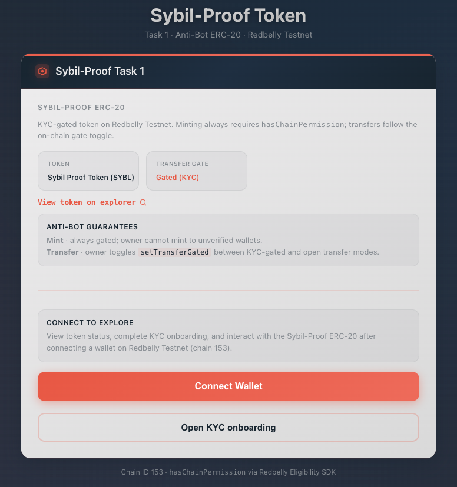
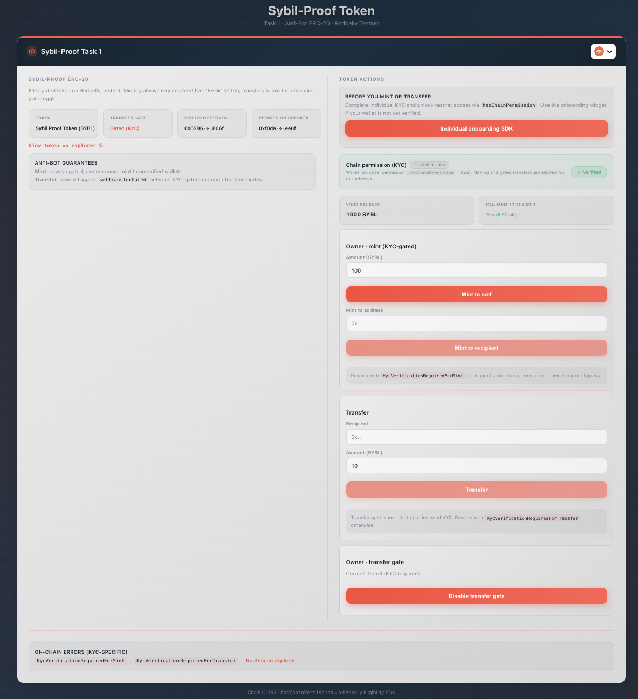

# Sybil-Proof ERC-20 - Task 1 (Anti-Bot Standard)

[](https://redbelly.network/)
[](https://soliditylang.org/)
[](https://hardhat.org/)
[](https://react.dev/)
[](https://openzeppelin.com/contracts/)
[](#quick-start)
[](docs/coverage/coverage-final.json)
[](https://redbelly-dao-task1.vercel.app/)
[](LICENSE)

KYC-gated ERC-20 on **Redbelly Testnet** (chain ID **153**) that blocks unverified wallets from minting and optionally from transferring, using Redbelly's on-chain **EligibilitySDK** signal (`hasChainPermission`).

Community submission for **Redbelly DAO Task 1** - Sybil-Proof ERC-20 (Anti-Bot Standard).

> **Docs note:** Full **IndividualOnboardingSDK** embed requires an **Averer developer API key** (per [Eligibility SDK installation](https://docs.redbelly.network/pages/eligibility-sdk/installation/)). We requested the key from Averer Customer Support; until it is issued, the UI uses an SDK-compatible `useHasChainPermission` shim and an onboarding entry point linked to the [Redbelly Access dApp](https://vine.redbelly.network/identity/user-access/) — same permission-check pattern as accepted Task 3. See [`REVIEWER.md`](REVIEWER.md).

## Task requirements (quick map)

| Task requirement | Where to verify |
|------------------|-----------------|
| Reviewer walkthrough (SDK shim, Averer API key note) | [`REVIEWER.md`](REVIEWER.md) |
| OpenZeppelin ERC-20 base | `contracts/SybilProofToken.sol` |
| `hasChainPermission` on gated actions | `SybilProofToken.sol`, `RedbellyPermissionChecker.sol` |
| Non-bypassable mint gate | `mint()` / `mintTo()` — KYC on caller/recipient; owner cannot bypass |
| Public mint (reviewer self-test) | `mint(uint256)` — any KYC'd wallet; see [`REVIEWER.md`](REVIEWER.md#reviewer-self-test-mint-live-dashboard--no-deployer-key) |
| Configurable transfer gate | `setTransferGated`, toggle tests |
| Admin update eligibility checker | `setPermissionChecker` |
| KYC-specific revert messages | `KycVerificationRequiredForMint`, `KycVerificationRequiredForTransfer` |
| React + IndividualOnboarding + `useHasChainPermission` | `ui/` — shim until Averer API key; see [`REVIEWER.md`](REVIEWER.md) |
| Unit tests, coverage ≥ 90% | `npm test`, artifact [`docs/coverage/coverage-final.json`](docs/coverage/coverage-final.json) |
| 5–7 page integration guide | [`docs/guide.md`](docs/guide.md) |
| Testnet deploy + verified source | [`docs/DEPLOYMENT.md`](docs/DEPLOYMENT.md), [live dashboard](https://redbelly-dao-task1.vercel.app/) |

## Quick start

```bash
npm install
npm run compile
npm test
npm run coverage    # regenerate docs/coverage/coverage-final.json
```

Deploy to testnet (requires `PRIVATE_KEY` in `.env` — see `.env.example`):

```bash
npm run deploy:testnet
npm run seed:demo   # mint if deployer has testnet Permission
```

Or open the [live dashboard](https://redbelly-dao-task1.vercel.app/). Local dev:

```bash
cd ui && npm install
npm run dev         # set VITE_TOKEN_ADDRESS in ui/.env after deploy
```

Or build:

```bash
npm run ui:build
```

## Documentation

| Document | Description |
|----------|-------------|
| [`REVIEWER.md`](REVIEWER.md) | DAO reviewer walkthrough |
| [`docs/guide.md`](docs/guide.md) | Integration guide (~6 pages) |
| [`docs/DEPLOYMENT.md`](docs/DEPLOYMENT.md) | Testnet addresses and demo transactions |
| [`docs/coverage/`](docs/coverage/) | Committed coverage artifact (100% lines) |
| [`docs/VERCEL.md`](docs/VERCEL.md) | UI deployment on Vercel ([live](https://redbelly-dao-task1.vercel.app/)) |

## Screenshots

**Public view** — token overview, anti-bot guarantees, **Connect to explore**, and **Connect Wallet** (no wallet required):



**Connected view** — KYC status, balance, owner mint/transfer actions, transfer gate toggle:



Live app: **[redbelly-dao-task1.vercel.app](https://redbelly-dao-task1.vercel.app/)**

## Architecture

```
User KYC (IndividualOnboardingSDK)
        ↓
Permission.isAllowed(address)  ←  Bootstrap registry
        ↓
RedbellyPermissionChecker.hasChainPermission
        ↓
SybilProofToken.mint / transfer (when gated)
```

## Testnet contracts

| Contract | Address |
|----------|---------|
| SybilProofToken (SYBL) | [`0x28b4841d24cEB8908aB042D14fdC47Ff4F41863d`](https://redbelly.testnet.routescan.io/address/0x28b4841d24cEB8908aB042D14fdC47Ff4F41863d) |
| RedbellyPermissionChecker | [`0xb8D9334984A070A8073a06EcB89fDe777eA6432C`](https://redbelly.testnet.routescan.io/address/0xb8D9334984A070A8073a06EcB89fDe777eA6432C) |

**Verified demo:** KYC mint OK [`0x54b1660…`](https://redbelly.testnet.routescan.io/tx/0x54b1660effff2f6c51b86f6b4c4f5403dfd5ab21d7e308d5b248f8c27e3b1d87). Reviewer self-test: [live dashboard](https://redbelly-dao-task1.vercel.app/) → mint before/after KYC (see [`REVIEWER.md`](REVIEWER.md#reviewer-self-test-mint-live-dashboard--no-deployer-key)).

Explorer: https://redbelly.testnet.routescan.io

## License

**MIT**. See [`LICENSE`](LICENSE).

## Submitter

Questions about this Task 1 submission?

[](https://discord.com/channels/969088176322908160/1378117350619873311)
