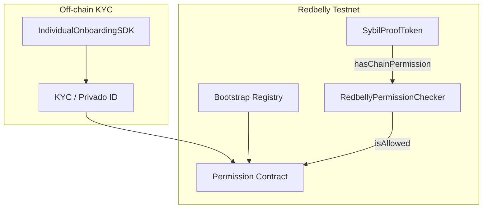

# Sybil-Proof ERC-20 — Integration Guide

**Task 1 · Redbelly Network · KYC-gated Anti-Bot ERC-20**

This document is the primary integration guide for developers and DAO reviewers evaluating the Sybil-Proof ERC-20 submission. It covers architecture, contract behaviour, frontend wiring, testing, security, and operational troubleshooting.

---

## 1. Executive summary

Airdrop farmers and bot networks exploit standard ERC-20 tokens because **any wallet can receive mints and transfers**. Off-chain whitelists are costly, opaque, and easy to game at scale.

This project delivers **SybilProofToken** — an OpenZeppelin ERC-20 that enforces **on-chain KYC** through Redbelly's existing eligibility infrastructure:

- **Minting** is always gated: even the contract owner cannot mint to an unverified address via `mintTo`.
- **Public mint** (`mint(uint256)`) allows any KYC-verified wallet to mint to itself — reviewers can self-test the benchmark without deployer keys.
- **Transfers** are optionally gated: the owner toggles between KYC-enforced and open transfer modes.
- **Eligibility** is read via `hasChainPermission(address)` from a pluggable checker contract (production: `RedbellyPermissionChecker` resolving `Permission.isAllowed` through Bootstrap).

Every reverting path exposes **KYC-specific custom errors**, not generic failure strings.

**Live dashboard:** [redbelly-dao-task1.vercel.app](https://redbelly-dao-task1.vercel.app/)  
**Reviewer walkthrough:** [`REVIEWER.md`](../REVIEWER.md)  
**Coverage artifact:** [`docs/coverage/coverage-final.json`](coverage/coverage-final.json)

---

## 2. Problem statement

| Challenge | Traditional approach | This solution |
|-----------|---------------------|---------------|
| Sybil airdrop claims | Off-chain CSV whitelist | On-chain Permission registry |
| Owner bypass risk | Trusted admin mint | Mint gate in `mint()` / `mintTo()` — no bypass |
| Reviewer cannot test mint | Owner-only mint | Public `mint(uint256)` gated on caller KYC |
| Transfer policy changes | Redeploy token | `setTransferGated(bool)` |
| Registry upgrades | Hard-coded address | `setPermissionChecker(address)` |

### 2.1 Design goals

1. **Sybil resistance at mint time** — unverified wallets must not accumulate supply.
2. **Configurable transfer policy** — projects may open secondary markets after initial distribution or keep transfers KYC-gated.
3. **Composable eligibility** — checker contract is swappable without redeploying the token.
4. **Auditable failures** — custom errors name the failing address and action.

---

## 3. Architecture



### 3.1 Contract roles

| Contract | Role |
|----------|------|
| `SybilProofToken` | ERC-20 with mint + optional transfer KYC gates |
| `RedbellyPermissionChecker` | Adapter: `hasChainPermission` → `Permission.isAllowed` |
| `MockPermissionChecker` | Local/test toggles for unit tests |

### 3.2 Permission resolution (production)

```solidity
function hasChainPermission(address account) external view returns (bool) {
    return IPermission(permission).isAllowed(account);
}
```

Bootstrap address (testnet & mainnet): `0xDAFEA492D9c6733ae3d56b7Ed1ADB60692c98Bc5`

Resolve Permission on testnet:

```bash
cast call 0xDAFEA492D9c6733ae3d56b7Ed1ADB60692c98Bc5 \
  "getContractAddress(string)(address)" "permission" \
  --rpc-url https://rpc-testnet.redbelly.network
```

Check whether a wallet is allowed:

```bash
cast call <PERMISSION_ADDRESS> \
  "isAllowed(address)(bool)" <WALLET> \
  --rpc-url https://rpc-testnet.redbelly.network
```

### 3.3 Data flow for a mint attempt

1. User calls `mint(amount)` on `SybilProofToken`.
2. Token calls `permissionChecker.hasChainPermission(msg.sender)`.
3. Checker resolves `Permission` via Bootstrap and calls `isAllowed(msg.sender)`.
4. If `false` → revert `KycVerificationRequiredForMint(msg.sender)`.
5. If `true` → `_mint(msg.sender, amount)` (OpenZeppelin internal mint; `from == address(0)`).

The same Permission read powers the React `useHasChainPermission` hook in the dashboard.

---

## 4. Smart contract reference

### 4.1 SybilProofToken

**Inheritance:** `ERC20`, `Ownable` (OpenZeppelin 4.9)

**Constructor:**

```solidity
constructor(
    string memory name_,
    string memory symbol_,
    address eligibilityChecker_,
    bool transferGated_
)
```

**Public / user functions:**

| Function | Description |
|----------|-------------|
| `mint(uint256 amount)` | Caller mints to self when KYC-verified |
| `transfer(address to, uint256 amount)` | Standard ERC-20 transfer; gated when `transferGated == true` |

**Owner functions:**

| Function | Description |
|----------|-------------|
| `mintTo(address to, uint256 amount)` | Owner mints to KYC-verified recipient (admin airdrop) |
| `setTransferGated(bool gated)` | Enable/disable transfer KYC gate |
| `setPermissionChecker(address checker)` | Point to new eligibility adapter |

**Not implemented:** There is **no public `burn` function** in this contract. Supply reduction via user-initiated burns is out of scope for Task 1.

**Custom errors:**

| Error | Meaning |
|-------|---------|
| `KycVerificationRequiredForMint(address recipient)` | Mint target lacks chain permission |
| `KycVerificationRequiredForTransfer(address from, address to)` | Transfer gate on; party lacks KYC |
| `InvalidEligibilityCheckerAddress()` | Zero address rejected for checker update |

### 4.2 Mint gate (non-bypassable)

Public mint — any wallet may call; gate checks **caller**:

```solidity
function mint(uint256 amount) external {
    if (!permissionChecker.hasChainPermission(msg.sender)) {
        revert KycVerificationRequiredForMint(msg.sender);
    }
    _mint(msg.sender, amount);
}
```

Owner airdrop — recipient must pass KYC; owner **cannot** bypass:

```solidity
function mintTo(address to, uint256 amount) external onlyOwner {
    if (!permissionChecker.hasChainPermission(to)) {
        revert KycVerificationRequiredForMint(to);
    }
    _mint(to, amount);
}
```

There is no `mintUnchecked` or internal bypass on either path.

**Reviewer benchmark:** connect a wallet without testnet Permission on the live dashboard → **Mint to my wallet** → on-chain revert `KycVerificationRequiredForMint`. Complete KYC via Access dApp → mint succeeds. No deployer private key required.

### 4.3 Transfer gate (configurable)

When `transferGated == true`, `_beforeTokenTransfer` validates both `from` and `to`:

```solidity
if (from != address(0) && transferGated) {
    if (!permissionChecker.hasChainPermission(from)) {
        revert KycVerificationRequiredForTransfer(from, to);
    }
    if (to != address(0) && !permissionChecker.hasChainPermission(to)) {
        revert KycVerificationRequiredForTransfer(from, to);
    }
}
```

**Note on `address(0)`:** OpenZeppelin ERC-20 uses `from == address(0)` for **minting** and `to == address(0)` for **burning** inside `_mint` / `_burn`. This contract exposes no public burn API, so end users cannot call `_burn` through an external function. The `to != address(0)` check simply skips the recipient KYC read during internal mint operations (when `from == address(0)`). It does **not** imply that unverified wallets can burn tokens.

When `transferGated == false`, peer-to-peer transfers behave like a standard ERC-20; the mint gate still applies.

### 4.4 Gas

The eligibility read is a single external `view` call. Unit tests assert `hasChainPermission` estimate **≤ 50,000 gas** on the mock checker (same call pattern as production `isAllowed`).

Typical gas (testnet, order of magnitude):

| Action | Notes |
|--------|-------|
| `mint(uint256)` | Permission read + mint storage write |
| `transfer` (gated) | Up to two Permission reads + transfer |
| `transfer` (ungated) | Standard ERC-20 transfer |

Exact values depend on network conditions and cold/warm storage. Use Routescan gas used on confirmed transactions as ground truth.

---

## 5. Deployment

### 5.1 Prerequisites

- Node.js 18+
- Wallet with RBNT on Redbelly Testnet
- `PRIVATE_KEY` in `.env` (never commit)

### 5.2 Commands

```bash
npm install
npm run compile
npm run deploy:testnet
```

Deploy script behaviour:

1. On chain 153: deploy `RedbellyPermissionChecker(Bootstrap)`
2. Else: deploy `MockPermissionChecker`
3. Deploy `SybilProofToken("Sybil Proof Token", "SYBL", checker, transferGated)`
4. Write `deployments/redbellyTestnet.json`

Environment variables:

| Variable | Default |
|----------|---------|
| `REDBELLY_TESTNET_RPC` | `https://rpc-testnet.redbelly.network` |
| `BOOTSTRAP_ADDRESS` | `0xDAFEA492D9c6733ae3d56b7Ed1ADB60692c98Bc5` |
| `TRANSFER_GATED` | `true` |

### 5.3 Post-deploy checklist

1. Verify source on Routescan (see [`DEPLOYMENT.md`](DEPLOYMENT.md)).
2. Set `VITE_TOKEN_ADDRESS` and `VITE_PERMISSION_CHECKER_ADDRESS` in `ui/.env`.
3. Run `npm run ui:build` and redeploy Vercel.
4. Run `npm run seed:demo` if deployer has testnet Permission.
5. Run `npm run demo:revert-mint` for eth_call revert proof.

Current testnet deployment (v2): see [`DEPLOYMENT.md`](DEPLOYMENT.md).

---

## 6. Frontend integration

### 6.1 Stack

- React 19 + Vite
- wagmi 2 + RainbowKit (matches Task 2 / Task 3 UI style)
- Eligibility SDK exports via `@redbellynetwork/eligibility-sdk`

### 6.2 useHasChainPermission

Per [Redbelly docs](https://docs.redbelly.network/pages/eligibility-sdk/client/hooks/useHasChainPermission/):

```jsx
import { useHasChainPermission } from "@redbellynetwork/eligibility-sdk";

function Status({ address }) {
  const { data, isLoading, refetch } = useHasChainPermission(address);

  if (isLoading) return <p>Checking KYC…</p>;
  return data ? <p>Verified</p> : <p>KYC required</p>;
}
```

This repo aliases the package to `ui/src/lib/eligibility-sdk/` when the private npm package is unavailable. The hook reads `Bootstrap.getContractAddress("permission")` then `Permission.isAllowed(address)`.

After a user completes KYC, call `refetch()` so the UI badge updates without a full page reload.

### 6.3 IndividualOnboardingSDK

Per [individual onboarding overview](https://docs.redbelly.network/pages/eligibility-sdk/onboarding/individual/overview/):

```jsx
import { IndividualOnboarding } from "@redbellynetwork/eligibility-sdk";

{open && <IndividualOnboarding onClose={() => setOpen(false)} />}
```

The shim renders a styled modal guiding users through wallet connect → KYC → testnet unlock, with a link to the [Redbelly Access dApp](https://vine.redbelly.network/identity/user-access/).

#### Why the official widget is not embedded in this submission

Per Redbelly docs, the full **IndividualOnboarding** React widget requires an **Averer developer API key** (*contact Averer Customer Support*). That key authorizes a dApp developer to run the Privado ID / KYC backend flow inside their own UI — it is **not** something end users obtain.

**Status:** the submitter **requested an API key from Averer Customer Support** before submission. The key was **not yet issued**, so this repo ships:

- **`useHasChainPermission`** — functionally identical to the [official hook](https://docs.redbelly.network/pages/eligibility-sdk/client/hooks/useHasChainPermission/) (reads `Permission.isAllowed` on-chain)
- **`IndividualOnboarding` shim** — onboarding entry point + Access dApp link

This matches the approach used in **Task 3** (accepted): prove eligibility via the same on-chain Permission registry without embedding the private npm widget.

**When the API key arrives**, upgrade steps:

1. Configure `.npmrc` and install `@redbellynetwork/eligibility-sdk`
2. Remove the Vite alias in `ui/vite.config.js`
3. Set `VITE_ELIGIBILITY_SDK_API_KEY` in `ui/.env`
4. Use official `<IndividualOnboarding />` inside `EligibilitySDKProvider`

Contract logic (`SybilProofToken`, `RedbellyPermissionChecker`) is unchanged — only the frontend KYC surface upgrades.

**Production SDK:** Install from GitHub Packages ([installation guide](https://docs.redbelly.network/pages/eligibility-sdk/installation/)):

```
@redbellynetwork:registry=https://npm.pkg.github.com
//npm.pkg.github.com/:_authToken=${GITHUB_TOKEN}
```

Wrap the app with `EligibilitySDKProvider`:

```jsx
<EligibilitySDKProvider config={{ network: "testnet", apiKey: "..." }}>
  <App />
</EligibilitySDKProvider>
```

### 6.4 UI environment

```
VITE_TOKEN_ADDRESS=0x…
VITE_PERMISSION_CHECKER_ADDRESS=0x…
VITE_ELIGIBILITY_SDK_API_KEY=   # optional, for official widget
```

### 6.5 User flow

1. Connect wallet (RainbowKit, chain 153).
2. Open **Individual onboarding SDK** if not verified.
3. Complete KYC + request testnet Permission via Access dApp.
4. UI shows `hasChainPermission === true`.
5. User clicks **Mint to my wallet** (public `mint(uint256)`).
6. Optional: owner uses **mintTo** for airdrops; any holder may **transfer** subject to gate.

### 6.6 Wiring mint in wagmi

```jsx
writeContract({
  address: tokenAddress,
  abi: TOKEN_ABI,
  functionName: "mint",
  args: [parseEther("100")],
});
```

Expect revert data `KycVerificationRequiredForMint` when Permission is false. Wallets often show a generic “execution reverted” — decode via Routescan or `cast call` for the exact error selector.

---

## 7. Testing

### 7.1 Commands

```bash
npm test                 # 16 unit/integration tests
npm run coverage         # regenerate docs/coverage/coverage-final.json
npm run ui:build         # frontend build smoke test
npm run demo:revert-mint # eth_call revert demo on testnet
```

Committed coverage artifact: [`docs/coverage/coverage-final.json`](coverage/coverage-final.json) — **100% line coverage** on contracts at last run.

### 7.2 Test matrix

| Scenario | Expected outcome | Test / evidence |
|----------|------------------|-----------------|
| Verified wallet `mint(uint256)` | Success, balance increases | `allows KYC-verified wallet to mint to self` |
| Unverified wallet `mint(uint256)` | `KycVerificationRequiredForMint` | `reverts public mint for unverified wallet` |
| Owner `mintTo` unverified | `KycVerificationRequiredForMint` | `does not allow owner to bypass mint KYC gate via mintTo` |
| Owner `mintTo` verified | Success | `owner mintTo succeeds for KYC-verified recipient` |
| Transfer gated, recipient unverified | `KycVerificationRequiredForTransfer` | transfer tests |
| Transfer ungated | Success to any address | `allows transfers when gate is disabled` |
| Toggle `setTransferGated` | Gate flips on-chain | toggle test |
| `setPermissionChecker` | New checker used | checker update test |
| Gas for Permission read | ≤ 50k | gas benchmark test |
| `RedbellyPermissionChecker` | Resolves via Bootstrap | integration test |

### 7.3 Local vs testnet testing

| Layer | Purpose |
|-------|---------|
| Hardhat + mocks | Fast regression, 100% coverage, no RBNT needed |
| Testnet + live Permission | End-to-end KYC, real `isAllowed` latency |
| Live dashboard | Reviewer self-test without private keys |

### 7.4 Manual testnet script

```bash
# Revert proof (no gas — eth_call)
npm run demo:revert-mint

# Mint if deployer has Permission
npm run seed:demo
```

Target: **≥ 90% line coverage** (currently 100% in committed artifact).

---

## 8. Security considerations

### 8.1 Trust and admin powers

The **owner** can:

- Call `mintTo` to distribute supply (recipient must still pass KYC).
- Toggle `setTransferGated` — opening or closing KYC enforcement on transfers.
- Point `setPermissionChecker` to a different adapter.

Token holders should treat owner key compromise as a **policy risk** (transfer gate could be disabled or checker replaced). Mitigations used in production deployments:

- Multisig owner (Gnosis Safe).
- Timelock on admin functions.
- Immutable checker address (deploy once, renounce ownership of checker updates).

### 8.2 Mint gate properties

- **Non-bypassable:** neither `mint` nor `mintTo` skips `hasChainPermission`.
- **Public mint surface:** any KYC'd wallet can inflate its own balance — intentional for reviewer testing and fair claims; production deployments may rate-limit off-chain or cap mint amounts in a wrapper contract if needed.

### 8.3 Checker integrity

`RedbellyPermissionChecker` is a thin adapter over the canonical Permission contract resolved from Bootstrap. Compromise of Permission or Bootstrap is a **network-level** eligibility risk, not unique to this token. Verify checker address matches deployment JSON before integrating.

### 8.4 Testnet vs mainnet Permission

Mainnet KYC does **not** automatically grant testnet Permission. Users must complete testnet unlock via the [Access dApp](https://vine.redbelly.network/identity/user-access/). UI and docs must not imply cross-network eligibility.

### 8.5 Burns and supply reduction

**SybilProofToken does not expose a public burn function.** Users cannot destroy SYBL through this contract's API. OpenZeppelin's internal `_burn` path is unused in the external interface. Therefore:

- There is **no** “unverified wallet burn” attack surface.
- Transfer-gate policy applies only to `transfer` / `transferFrom` between non-zero addresses.
- If future versions require burn-with-KYC, add an explicit `burn(uint256)` that applies the same Permission checks as transfers.

### 8.6 Frontend / SDK trust boundary

The dashboard reads Permission on-chain; the shim does not grant eligibility client-side. A malicious frontend could lie about KYC status in the UI, but **on-chain mint/transfer still enforces** the real Permission state. Always treat chain state as source of truth.

---

## 9. Troubleshooting

This section covers the most common integration failures reported during testnet development and reviewer walkthroughs.

### 9.1 Gas estimation failures

**Symptoms:** MetaMask/RainbowKit shows “cannot estimate gas”, Hardhat `estimateGas` throws, or the wallet never opens a confirm dialog.

**Typical causes on this project:**

| Cause | Explanation |
|-------|-------------|
| Expected revert | `mint` without KYC always reverts with `KycVerificationRequiredForMint`. Estimators simulate the tx and fail because the call would not succeed. |
| Transfer gate | Gated transfer to/from unverified party reverts with `KycVerificationRequiredForTransfer`. |
| Wrong network | Token on chain 153; wallet on another chain → contract call fails. |
| Unconfigured token | `VITE_TOKEN_ADDRESS` zero → UI calls invalid address. |

**Fixes:**

1. **Mint before KYC:** this is correct behaviour. Submit with explicit `gasLimit` if you need an on-chain revert receipt for demo:

   ```typescript
   await token.mint(amount, { gasLimit: 300_000n });
   ```

2. **Verify Permission first:**

   ```bash
   cast call <PERMISSION> "isAllowed(address)(bool)" <YOUR_WALLET> \
     --rpc-url https://rpc-testnet.redbelly.network
   ```

3. **Use eth_call / staticCall** when you only need to prove revert semantics (see `npm run demo:revert-mint`).

4. **Complete KYC** then retry — estimation should succeed once `isAllowed` returns true.

5. **Check chain ID** — wallet must show Redbelly Testnet (153).

### 9.2 SDK widget not rendering

**Symptoms:** “Individual onboarding” modal blank, import error for `@redbellynetwork/eligibility-sdk`, or hook stuck loading.

**Cause A — private npm package not installed**

This submission uses a **Vite alias** to `ui/src/lib/eligibility-sdk/` because `@redbellynetwork/eligibility-sdk` requires GitHub Packages auth and an Averer API key. If you remove the alias without installing the real package, imports break.

**Fix:** keep the alias (default in this repo) or complete official install per [installation guide](https://docs.redbelly.network/pages/eligibility-sdk/installation/).

**Cause B — missing Averer API key (official widget only)**

The full embedded Privado ID widget will not initialise without `VITE_ELIGIBILITY_SDK_API_KEY`. The shim modal still works — it links to the Access dApp.

**Fix:** use shim + Access dApp (current submission) or obtain Averer developer key and set env var.

**Cause C — wagmi not connected / wrong chain**

`useHasChainPermission` returns early when `address` is undefined or chain ≠ 153.

**Fix:** connect wallet, switch to Redbelly Testnet, wait for `refetch()` after KYC.

**Cause D — Permission contract read fails**

RPC error or Bootstrap misconfiguration → hook may show “Checking…” indefinitely.

**Fix:** see § 9.3; verify RPC; confirm `BOOTSTRAP_ADDRESS` and Permission resolution.

### 9.3 RPC timeouts and flaky reads

**Symptoms:** `useHasChainPermission` spins, balance reads return undefined, deploy hangs, “timeout” or 502 from provider.

**Default RPC endpoints:**

| Use | URL |
|-----|-----|
| Hardhat / scripts | `https://rpc-testnet.redbelly.network` |
| wagmi (dashboard) | `https://governors.testnet.redbelly.network` |

**Fixes:**

1. **Retry with backoff** — testnet RPC can be bursty; refresh page or call `refetch()`.
2. **Override RPC** in `.env`:

   ```
   REDBELLY_TESTNET_RPC=https://rpc-testnet.redbelly.network
   ```

3. **Increase Hardhat timeout** if deploying on slow blocks:

   ```typescript
   // hardhat.config.ts — networks.redbellyTestnet.timeout
   timeout: 120_000,
   ```

4. **Fall back to cast/curl** to isolate UI vs RPC:

   ```bash
   cast block-number --rpc-url https://rpc-testnet.redbelly.network
   ```

5. **Redbelly write authorization:** some wallets see `Sender not authorised to write transactions` until testnet access is granted via Access dApp — this is network policy, not a contract bug.

### 9.4 Quick diagnostic checklist

| Check | Command / action |
|-------|------------------|
| Chain ID | Wallet shows 153 |
| Token configured | `VITE_TOKEN_ADDRESS` set in Vercel/env |
| Permission | `isAllowed(wallet)` via cast |
| Mint revert (expected) | `npm run demo:revert-mint` |
| Coverage | Open `docs/coverage/coverage-final.json` |
| Verified source | Routescan green checkmark on token address |

---

## 10. References

- [Redbelly Eligibility SDK](https://docs.redbelly.network/pages/eligibility-sdk/overview/)
- [useHasChainPermission hook](https://docs.redbelly.network/pages/eligibility-sdk/client/hooks/useHasChainPermission/)
- [Individual onboarding](https://docs.redbelly.network/pages/eligibility-sdk/onboarding/individual/overview/)
- [Redbelly Access dApp](https://vine.redbelly.network/identity/user-access/)
- Testnet RPC: `https://rpc-testnet.redbelly.network` (chain 153)
- Explorer: https://redbelly.testnet.routescan.io
- Reviewer guide: [`REVIEWER.md`](../REVIEWER.md)
- Deployment: [`DEPLOYMENT.md`](DEPLOYMENT.md)

---

*End of integration guide.*
