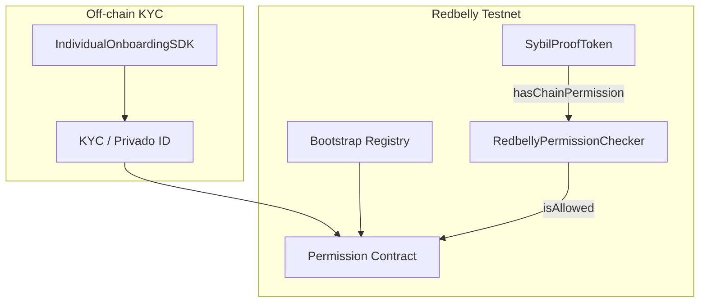

# Sybil-Proof ERC-20 — Integration Guide

**Task 1 · Redbelly Network · KYC-gated Anti-Bot ERC-20**

---

## 1. Executive summary

Airdrop farmers and bot networks exploit standard ERC-20 tokens because **any wallet can receive mints and transfers**. Off-chain whitelists are costly, opaque, and easy to game at scale.

This project delivers **SybilProofToken** — an OpenZeppelin ERC-20 that enforces **on-chain KYC** through Redbelly's existing eligibility infrastructure:

- **Minting** is always gated: even the contract owner cannot mint to an unverified address.
- **Transfers** are optionally gated: the owner toggles between KYC-enforced and open transfer modes.
- **Eligibility** is read via `hasChainPermission(address)` from a pluggable checker contract (production: `RedbellyPermissionChecker` resolving `Permission.isAllowed` through Bootstrap).

Every reverting path exposes **KYC-specific custom errors**, not generic failure strings.

---

## 2. Problem statement

| Challenge | Traditional approach | This solution |
|-----------|---------------------|---------------|
| Sybil airdrop claims | Off-chain CSV whitelist | On-chain Permission registry |
| Owner bypass risk | Trusted admin mint | Mint gate in `mint()` — no bypass |
| Transfer policy changes | Redeploy token | `setTransferGated(bool)` |
| Registry upgrades | Hard-coded address | `setPermissionChecker(address)` |

---

## 3. Architecture



### 3.1 Contract roles

| Contract | Role |
|----------|------|
| `SybilProofToken` | ERC-20 with mint + optional transfer KYC gates |
| `RedbellyPermissionChecker` | Adapter: `hasChainPermission` → `Permission.isAllowed` |
| `MockPermissionChecker` | Local/test toggles for unit tests |

### 3.2 Permission resolution (production)

```solidity
function hasChainPermission(address account) external view returns (bool) {
    return IPermission(permission).isAllowed(account);
}
```

Bootstrap address (testnet & mainnet): `0xDAFEA492D9c6733ae3d56b7Ed1ADB60692c98Bc5`

Resolve Permission:

```bash
cast call 0xDAFEA492D9c6733ae3d56b7Ed1ADB60692c98Bc5 \
  "getContractAddress(string)(address)" "permission" \
  --rpc-url https://rpc-testnet.redbelly.network
```

---

## 4. Smart contract reference

### 4.1 SybilProofToken

**Inheritance:** `ERC20`, `Ownable` (OpenZeppelin 4.9)

**Constructor:**

```solidity
constructor(
    string memory name_,
    string memory symbol_,
    address eligibilityChecker_,
    bool transferGated_
)
```

**Owner functions:**

| Function | Description |
|----------|-------------|
| `mint(uint256 amount)` | Any caller mints to self when KYC-verified |
| `mintTo(address to, uint256 amount)` | Owner mints to KYC-verified recipient (admin airdrop) |
| `setTransferGated(bool gated)` | Enable/disable transfer KYC gate |
| `setPermissionChecker(address checker)` | Point to new eligibility adapter |

**Custom errors:**

| Error | Meaning |
|-------|---------|
| `KycVerificationRequiredForMint(address recipient)` | Recipient lacks chain permission |
| `KycVerificationRequiredForTransfer(address from, address to)` | Transfer gate on; party lacks KYC |
| `InvalidEligibilityCheckerAddress()` | Zero address rejected for checker update |

### 4.2 Mint gate (non-bypassable)

Public mint — any wallet may call; gate checks **caller**:

```solidity
function mint(uint256 amount) external {
    if (!permissionChecker.hasChainPermission(msg.sender)) {
        revert KycVerificationRequiredForMint(msg.sender);
    }
    _mint(msg.sender, amount);
}
```

Owner airdrop — recipient must pass KYC; owner **cannot** bypass:

```solidity
function mintTo(address to, uint256 amount) external onlyOwner {
    if (!permissionChecker.hasChainPermission(to)) {
        revert KycVerificationRequiredForMint(to);
    }
    _mint(to, amount);
}
```

There is no `mintUnchecked` or internal bypass on either path.

### 4.3 Transfer gate (configurable)

When `transferGated == true`, `_beforeTokenTransfer` validates both `from` and `to` (except burn `to == address(0)`):

```solidity
if (from != address(0) && transferGated) {
    if (!permissionChecker.hasChainPermission(from)) {
        revert KycVerificationRequiredForTransfer(from, to);
    }
    if (to != address(0) && !permissionChecker.hasChainPermission(to)) {
        revert KycVerificationRequiredForTransfer(from, to);
    }
}
```

When `transferGated == false`, transfers behave like a standard ERC-20 (mint gate still applies).

### 4.4 Gas

The eligibility read is a single external `view` call. Unit tests assert `hasChainPermission` estimate **≤ 50,000 gas** on the mock checker (same call pattern as production `isAllowed`).

---

## 5. Deployment

### 5.1 Prerequisites

- Node.js 18+
- Wallet with RBNT on Redbelly Testnet
- `PRIVATE_KEY` in `.env`

### 5.2 Commands

```bash
npm install
npm run compile
npm run deploy:testnet
```

Deploy script behaviour:

1. On chain 153: deploy `RedbellyPermissionChecker(Bootstrap)`
2. Else: deploy `MockPermissionChecker`
3. Deploy `SybilProofToken("Sybil Proof Token", "SYBL", checker, transferGated)`
4. Write `deployments/redbellyTestnet.json`

Environment variables:

| Variable | Default |
|----------|---------|
| `REDBELLY_TESTNET_RPC` | `https://rpc-testnet.redbelly.network` |
| `BOOTSTRAP_ADDRESS` | `0xDAFEA492D9c6733ae3d56b7Ed1ADB60692c98Bc5` |
| `TRANSFER_GATED` | `true` |

See [`DEPLOYMENT.md`](DEPLOYMENT.md) for verification commands.

---

## 6. Frontend integration

### 6.1 Stack

- React 19 + Vite
- wagmi 2 + RainbowKit (matches Task 2 / Task 3 UI style)
- Eligibility SDK exports via `@redbellynetwork/eligibility-sdk`

### 6.2 useHasChainPermission

Per [Redbelly docs](https://docs.redbelly.network/pages/eligibility-sdk/client/hooks/useHasChainPermission/):

```jsx
import { useHasChainPermission } from "@redbellynetwork/eligibility-sdk";

function Status({ address }) {
  const { data, isLoading, refetch } = useHasChainPermission(address);

  if (isLoading) return <p>Checking KYC…</p>;
  return data ? <p>Verified</p> : <p>KYC required</p>;
}
```

This repo aliases the package to `ui/src/lib/eligibility-sdk/` when the private npm package is unavailable. The hook reads `Bootstrap.getContractAddress("permission")` then `Permission.isAllowed(address)`.

### 6.3 IndividualOnboardingSDK

Per [individual onboarding overview](https://docs.redbelly.network/pages/eligibility-sdk/onboarding/individual/overview/):

```jsx
import { IndividualOnboarding } from "@redbellynetwork/eligibility-sdk";

{open && <IndividualOnboarding onClose={() => setOpen(false)} />}
```

The shim renders a styled modal guiding users through wallet connect → KYC → testnet unlock, with a link to the [Redbelly Access dApp](https://vine.redbelly.network/identity/user-access/).

#### Why the official widget is not embedded in this submission

Per Redbelly docs, the full **IndividualOnboarding** React widget requires an **Averer developer API key** (*contact Averer Customer Support*). That key authorizes a dApp developer to run the Privado ID / KYC backend flow inside their own UI — it is **not** something end users obtain.

**Status:** the submitter **requested an API key from Averer Customer Support** before submission. The key was **not yet issued**, so this repo ships:

- **`useHasChainPermission`** — functionally identical to the [official hook](https://docs.redbelly.network/pages/eligibility-sdk/client/hooks/useHasChainPermission/) (reads `Permission.isAllowed` on-chain)
- **`IndividualOnboarding` shim** — onboarding entry point + Access dApp link

This matches the approach used in **Task 3** (accepted): prove eligibility via the same on-chain Permission registry without embedding the private npm widget.

**When the API key arrives**, upgrade steps:

1. Configure `.npmrc` and install `@redbellynetwork/eligibility-sdk`
2. Remove the Vite alias in `ui/vite.config.js`
3. Set `VITE_ELIGIBILITY_SDK_API_KEY` in `ui/.env`
4. Use official `<IndividualOnboarding />` inside `EligibilitySDKProvider`

Contract logic (`SybilProofToken`, `RedbellyPermissionChecker`) is unchanged — only the frontend KYC surface upgrades.

**Production SDK:** Install from GitHub Packages ([installation guide](https://docs.redbelly.network/pages/eligibility-sdk/installation/)):

```
@redbellynetwork:registry=https://npm.pkg.github.com
//npm.pkg.github.com/:_authToken=${GITHUB_TOKEN}
```

Wrap the app with `EligibilitySDKProvider`:

```jsx
<EligibilitySDKProvider config={{ network: "testnet", apiKey: "..." }}>
  <App />
</EligibilitySDKProvider>
```

### 6.4 UI environment

```
VITE_TOKEN_ADDRESS=0x…
VITE_PERMISSION_CHECKER_ADDRESS=0x…
VITE_ELIGIBILITY_SDK_API_KEY=   # optional, for official widget
```

### 6.5 User flow

1. Connect wallet (RainbowKit, chain 153)
2. Open **Individual onboarding SDK** if not verified
3. Complete KYC + request testnet Permission
4. UI shows `hasChainPermission === true`
5. Owner mints / user transfers (respecting transfer gate)

---

## 7. Testing

```bash
npm test
npm run coverage
```

| Test area | Coverage |
|-----------|----------|
| Mint to verified / unverified | ✓ |
| Owner bypass attempt | ✓ |
| Transfer gated / ungated | ✓ |
| Toggle `setTransferGated` | ✓ |
| Update checker | ✓ |
| Gas ≤ 50k | ✓ |
| RedbellyPermissionChecker + MockBootstrap | ✓ |

Target: **≥ 90% line coverage**.

---

## 8. Security considerations

1. **Owner trust:** Owner can disable transfer gate or change checker — document this for token holders.
2. **Checker integrity:** Use immutable production checker or timelock on `setPermissionChecker`.
3. **Testnet vs mainnet:** KYC on mainnet does not auto-grant testnet Permission — users must unlock each network.
4. **No burn gate:** Burns from unverified wallets are allowed when gated; adjust if policy requires otherwise.

---

## 9. References

- [Redbelly Eligibility SDK](https://docs.redbelly.network/pages/eligibility-sdk/overview/)
- [useHasChainPermission hook](https://docs.redbelly.network/pages/eligibility-sdk/client/hooks/useHasChainPermission/)
- [Individual onboarding](https://docs.redbelly.network/pages/eligibility-sdk/onboarding/individual/overview/)
- [Redbelly Access dApp](https://vine.redbelly.network/identity/user-access/)
- Testnet RPC: `https://rpc-testnet.redbelly.network` (chain 153)
- Explorer: https://redbelly.testnet.routescan.io

---

*End of integration guide.*
